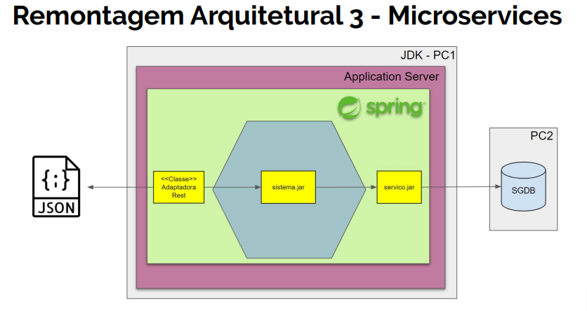
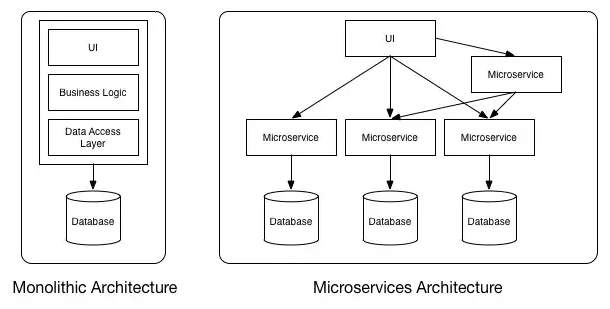

# Remontagem 3 - Microserviços
**Objetivo**  
Criar um adaptador REST que permita o  acesso ao modelo de domínio do negocio (Hexagono),  
utilizando microserviços REST.




Um Microservice, consiste na abordagem que  
desenvolve uma
solução como uma suíte de pequenos serviços  
isolados e independentes, cada um executando  
seu próprio processo e se comunicando através
de REST.




**Definição arquiteturais**
1. Escolher um servidor de aplicação.
2. Escolher um framework de microservices.
3. Implementar um novo adaptador primário que
   receba os dados via REST, repassando os input
   para mesma porta primária já existente,
   para processar a lógica da operação dentro do
   hexágono.


**Definições de Design**  
Implementar o modulos controler REST
- Executado dentro do Application Java Server
- Micro profile Web
- Será gera um artefato de software (.war)

**Ambiente**
- Java 12 (Jakarta EE server faces)
- IDE Intellij
- Maven
- BD HSQLDB (Embedded)
- Apache TomEE (Embedded) - porta 8080
- Web Micro Profile REST (Embeded) - porta 8090
- Spring Web
- Swagger Micropofile UI (Documentação da API)

**Dependências Negócio(Hexagono)**
- conta.sistema

**Dependências Backservices(infra)**
- conta.servicos

**Dependências Tecnologicas**
1. Maven
2. CDI
3. Spring IoC
4. Spring Transactions
5. Spring Jdbc
6. Hsqldb
7. Spring Web
8. JEE 8 Web Profile
9. Microprofile
10. Microprofile Swagger UI


**pacotes infra**   
conta.micro.infra - Infra do spring  
conta.micro.rest - Contém a implementação da API REST    
conta.micro.to - Contém a implementação das classes dos obejtos de tranfencia


**Recursos Microprofile**
- Health - Endpoint verifica se o serviço esta on
- Metrics  - Memoria, Jvm
- Openapi.json - json com todos os endponts do serviço
- Swagger microprofile - UI de interface para documentação da API REST


**Arquivos de Configuração**
1. spring-web-buiild5.xml
2. web.xml
3. index.jsp
4. pom.xml
5. spring.xml


1.1 spring-web-buiild5.xml
- Arquivo de configuração de Build do sistema, com Spring no formado xml.
  Inicializa e prepara todo do ambiente que o sistema ira rodar.
- Banco de dados Embedded
- Data Sorce
- Spring transaction
- Scan da busca de dependencias de negocio do sistema (hexagono).

Arquivo que prepara para o sistem todo ambiente necessario a execução
do sistema
Sendo que cada build prepara a execução do sistema por ambiente de desenvolvimento
homologação e produção. Sendo o Build 1, executado no projeto do dominio (hexagono)
e os Builds 2, 3 e 4 executados no projeto de frontend.

conta.micro.infra.Spring - Ira permitir o REST acessar os
beans que estão no container do sprring.


2.1 web.xml
- Arquivo de configuração do WebServlet do Java.
  Faz a chamada inicial do sistema web.
  Le o configuração do sistema ```spring-web-buiild5.xml```e levanta
  o contexto e acesso as arquivos de configuração.
- Sobe o Container Spring
- Timeout do sistema
- Configuração da pagina inicial do sistema
- Ativa as configuração do JSF

3.1 index.jsp
- Nesse projeto é um arquivo especifico de links para itens gerados automaticamente,
  para monitoramento e acompanhamento das metricas   
  do micro serviço profile e acesso a pagina da documentação da API
  Rest com Swagger UI.
  Alem de uma lista em json das API do microservico.

4.1 pom.xml
- Arquivo do Maven (Gerenciador de dependência)  
  entre paths de URL e os servlets.

5.1 spring.xml
- Reponsanvel por fazer integração
  do spring para os beans ejb/cdi

**Arquivos da implementação**

**TO** - Implementa os inpus do JSON para o REST (devem ser criados pelo cliente e enviados)

**Controller (REST)** - Adaptador Microprofile REST de acesso ao hexagono API

**Classe Spring** - Beans de listerner application.
Responsavel por fazer a integração do spring com os beans
ejb/cdi. Responsavel por Injetar o hexagono no contexto do microprofile.
O REST esta rodando em cima do JEE que vai rodar cima do Microprofile.
o Hexagono esta rodano no spring framework, os dois container
rodam juntos o Spring e o Microprofile.

**NegocioException** - Mapeia os erros do hexagono para um BadRequest do REST
que coloca a msg vinda do hexano no contexto do REST micro profile.

**CORSFilter**  
Filtro parae habilitar do servidor http fazer chamadas para diferentes dominios
para expor a API Rest.

**ContaMicroservices**  
Classe auxiliar de configuração do Microprofile, para subir o endereço padrão
do aplication REST.

**Implementações visual**
- Não tem, somente pagina de links para metricas do microprofile.
- Swagger UI para documentação da API do microprofile REST


# Referências

### Opções de Design
Organização de Pacotes: Links úteis de discussão sobre o assunto:  
● https://proandroiddev.com/package-by-type-by-layer-by-feature-vs-pa ckage-by-layered-feature-e59921a4dffa    
● https://dzone.com/articles/package-by-feature-is-demanded    
● https://dzone.com/articles/package-your-classes-feature


Transferência de dados Links:  
● https://refactoring.guru/introduce-parameter-object  
● https://deviq.com/value-object/  
● https://mrhaki.blogspot.com/2009/10/groovy-goodness-expando-asdynamic-bean.html  
● https://fernandofranzini.wordpress.com/2013/02/28/generics-item-2  
● http://wavelino.coffeecup.com/pdf/EffectiveJava.pdf

Arquitetura:  
http://tutorials.jenkov.com/software-architecture/client-server-architecture.htm

Clássica 3-tier application architecture.   
http://tutorials.jenkov.com/software-architecture/n-tier-architecture.html

Responsive Web Design - RWD.
https://brasil.uxdesign.cc/o-que-%C3%A9-responsive-web-design-ab292eb616b7

Microserviços:
https://www.redhat.com/pt-br/topics/microservices/what-are-microservices

Thin client
https://pt.wikipedia.org/wiki/Thin_client

MVC Thin cliente side
https://guidefreitas.github.io/programming/2015/07/17/aplicacoes-mvc-client-side.html

Aplicativos Hibridos com Ionic
https://medium.com/trainingcenter/aplicativos-h%C3%ADbridos-vil%C3%B5es-ou-mocinhos-b22276f523c0
